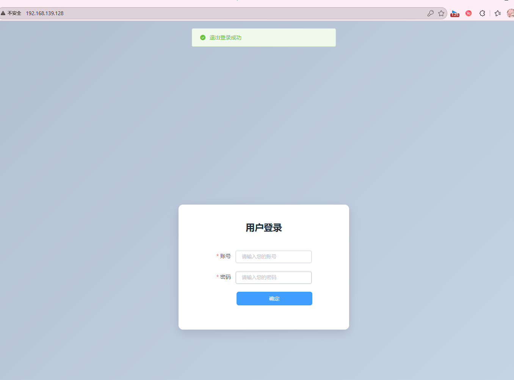
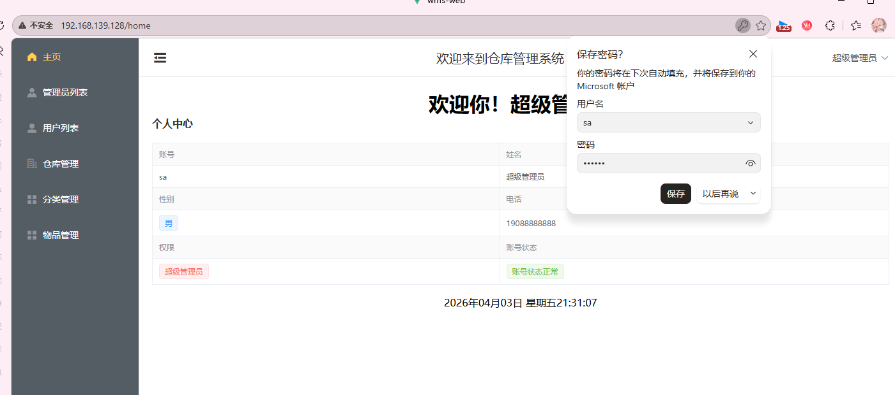
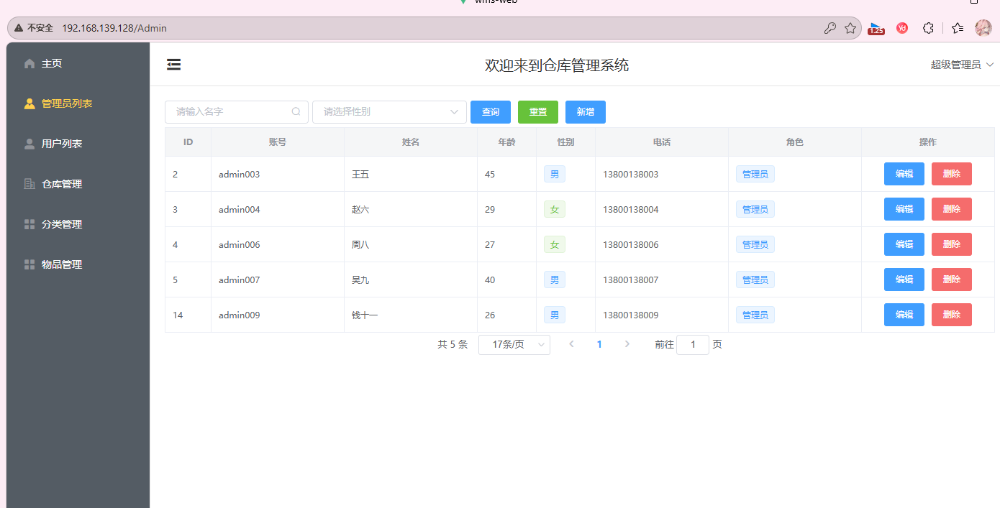
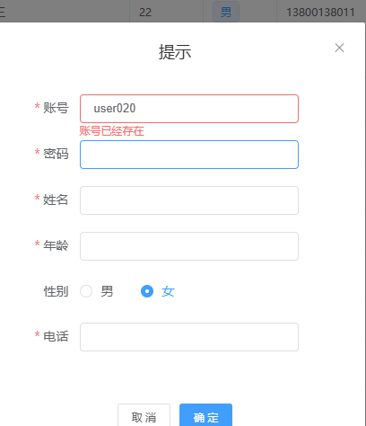
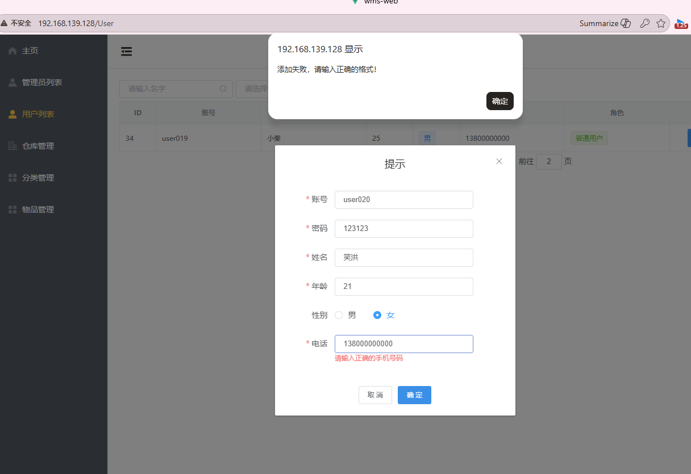
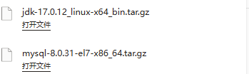
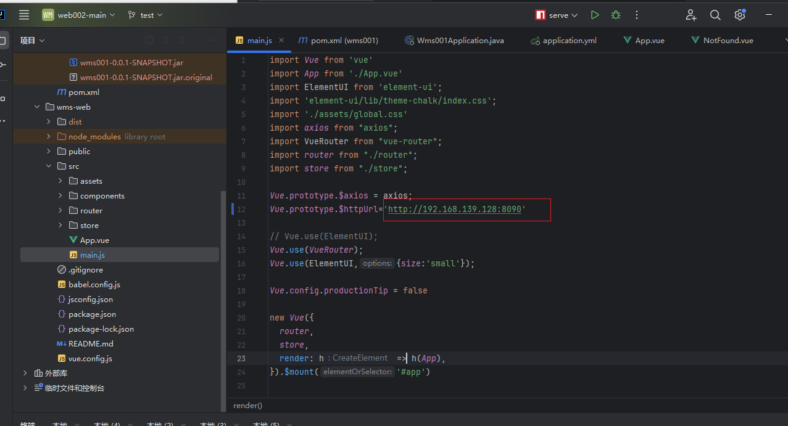
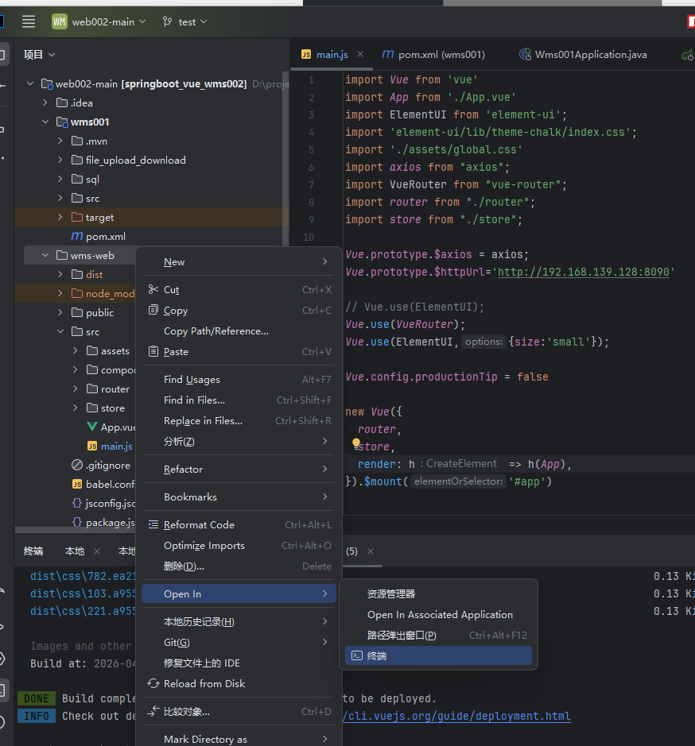
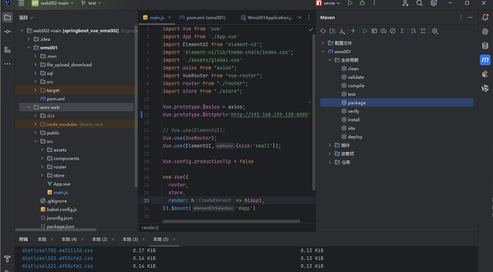
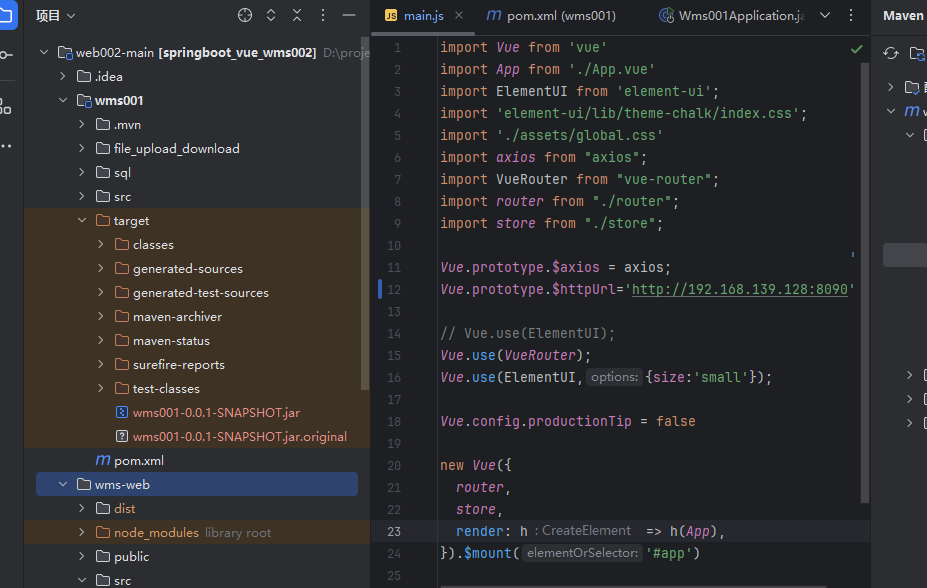

# 项目部署到linux服务器

# 0 登录



# 1 主页



# 2 管理员列表



# 各种表格校验，后端基本上也做了对应的处理（防啥呢。。

账号是否重复



各种数据正常格式




### 等等，其他页面也是差不多的，这里主要记录一下如何部署到linux上面吧


# 部署到linux上面，使用centos7，java17

所需准备，这里是直接下载好了，使用mobaxterm上传就ok了




# 这里主要分为3个步骤


# 一，打包

# 1.0 修改项目对应的访问接口



## 1.1 打包前端和后端项目

前端打包，打开对应文件夹终端，输入

```
npm run build
```



最终成果 一个dist文件夹

## 1.2 后端打包项目

打开maven，然后打开生命周期，然后双击package



最后打包成果是，，，jar这个文件




### 到这里打包结束，然后开始配置linux方面的东西，过程中有一些问题是正常的，问问ai，查查文档就可以了


***

***

***


# Linux部署项目（MySQL+JDK+后端+Nginx）操作笔记

## 一、MySQL相关操作（核心：建库、授权、导入数据）

### 1. 登录MySQL（解决密码错误问题）

场景：初始登录密码错误/空密码，重置root密码

```bash
# 登录MySQL（初始空密码直接回车，无需输入密码）
mysql -u root -p

# 重置root密码为123456（执行3条SQL）
ALTER USER 'root'@'localhost' IDENTIFIED BY '123456';
FLUSH PRIVILEGES;
exit;
```

### 2. 创建wms数据库（解决Unknown database 'wms'报错）

```bash
# 重新登录MySQL（密码123456）
mysql -u root -p

# 创建数据库（编码格式适配项目，避免中文乱码）
CREATE DATABASE wms CHARACTER SET utf8mb4 COLLATE utf8mb4_unicode_ci;

# 退出MySQL
exit;
```

### 3. 导入数据库数据（解决数据库空表问题）

```bash
# 确认SQL文件路径（此处路径为/root/data/wms.sql，根据实际修改）
ls /root/data/wms.sql

# 导入数据（密码123456，wms为数据库名，路径对应SQL文件）
mysql -u root -p wms < /root/data/wms.sql

# 验证导入成功（登录MySQL查看表）
mysql -u root -p
use wms;
show tables; # 出现表名即为导入成功
exit;
```

### 4. MySQL授权（解决后端连接数据库权限不足、报错1045）

场景：MySQL 8.0版本，旧授权语法报错，用新语法

```bash
# 登录MySQL（密码123456）
mysql -u root -p

# 执行3条授权命令（允许远程连接，密码123456）
CREATE USER 'root'@'%' IDENTIFIED BY '123456';
GRANT ALL PRIVILEGES ON *.* TO 'root'@'%' WITH GRANT OPTION;
FLUSH PRIVILEGES;

exit;
```

## 二、JDK 17安装（解决后端启动报错：版本不兼容）

场景：本地JDK17打包，服务器JDK8不兼容，手动安装JDK17（CentOS 7）

### 1. 本地下载+上传JDK17压缩包

1. 本地浏览器下载：https://mirrors.tuna.tsinghua.edu.cn/Adoptium/17/jdk/x64/linux/OpenJDK17U-jdk_x64_linux_hotspot_17.0.13_10.tar.gz

2. 用MobaXterm将压缩包拖到服务器/root目录

### 2. 解压+配置环境变量

```bash
# 解压JDK压缩包（文件名根据实际下载的版本修改）
tar -zxvf OpenJDK17U-jdk_x64_linux_hotspot_17.0.13_10.tar.gz

# 移动到系统目录，统一命名为jdk17
mv jdk-17.0.13+10 /usr/local/jdk17

# 配置环境变量（一键写入，无需手动编辑）
echo -e "export JAVA_HOME=/usr/local/jdk17\nexport PATH=\$JAVA_HOME/bin:\$PATH" >> /etc/profile

# 让环境变量立即生效
source /etc/profile

# 验证安装成功（出现17.0.x版本即为成功）
java -version
```

## 三、后端项目启动（解决后端启动失败、端口不匹配）

### 1. 启动后端Jar包

```bash
# 后台启动后端（路径为/root/data/wms001-0.0.1-SNAPSHOT.jar，根据实际修改）
nohup java -jar /root/data/wms001-0.0.1-SNAPSHOT.jar > app.log 2>&1 
```

### 2. 查看后端启动状态（3种方法）

```bash
# 方法1：查看Java进程（有wms相关Jar包即为启动）
ps -ef | grep java

# 方法2：查看后端日志（关键，判断是否启动成功/报错）
tail -20 app.log # 查看最后20行日志
# 出现"Started Wms001Application in X.X seconds"即为启动成功

# 方法3：查看后端端口（项目端口为8090，非默认8080）
netstat -lntp | grep 8090 # 出现LISTEN即为正常
```

### 3. 重启后端（修改配置/数据库后需执行）

```bash
# 杀死旧的后端进程（一键杀死所有Java进程，或指定进程）
pkill -f java
# 重新启动后端
nohup java -jar /root/data/wms001-0.0.1-SNAPSHOT.jar > app.log 2>&1 
```

## 四、Nginx配置（解决前端无法访问后端接口）

场景：后端端口8090，前端请求需通过Nginx转发，修正配置

```bash
# 打开Nginx配置文件
vi /etc/nginx/nginx.conf

# 替换配置内容（修改server_name为自己的虚拟机IP，如192.168.139.128）
# 配置内容如下：
user nginx;
worker_processes auto;

error_log /var/log/nginx/error.log;
pid /run/nginx.pid;

include /usr/share/nginx/modules/*.conf;

events {
    worker_connections 1024;
}

http {
    include       mime.types;
    default_type  application/octet-stream;

    sendfile        on;
    keepalive_timeout 65;

    server {
        listen 80;
        server_name 192.168.139.128; # 替换为你的虚拟机IP

        # 转发后端接口（匹配/user/、/admin/等接口，转发到8090端口）
        location ~ ^/(user|admin|product|system)/ {
            proxy_pass http://127.0.0.1:8090;
            proxy_set_header Host $host;
            proxy_set_header X-Real-IP $remote_addr;
            proxy_set_header X-Forwarded-For $proxy_add_x_forwarded_for;
        }

        # 处理前端页面（前端dist文件夹路径：/usr/share/nginx/html/dist）
        location / {
            root /usr/share/nginx/html/dist;
            index index.html;
            try_files $uri $uri/ /index.html;
        }
    }
}

# 保存退出：按ESC，输入:wq，回车

# 验证Nginx配置是否正确
nginx -t

# 重启Nginx生效
nginx -s reload
```

## 五、常见报错及解决方案（重点！）

- **报错1：ERROR 1045 (28000): Access denied for user 'root'@'localhost'** → 密码错误，重置MySQL root密码（参考一、1）

- **报错2：ERROR 1049 (42000): Unknown database 'wms'** → 未创建wms数据库，执行建库命令（参考一、2）

- **报错3：Java版本不兼容（class file version 61.0 vs 52.0）** → 服务器JDK版本过低，安装JDK17（参考二）

- **报错4：MySQL授权语法错误（ERROR 1064）** → MySQL 8.0不支持旧语法，用新授权命令（参考一、4）

- **报错5：后端启动后，前端无法登录（500错误）** → 数据库空表，重新导入SQL文件（参考一、3）

- **报错6：wget下载JDK报错404** → 关闭代理（unset http_proxy https_proxy），改用本地下载上传（参考二、1）

## 六、最终验证（项目跑通标准）

1. MySQL：登录后use wms; show tables; 能看到表

2. JDK：java -version 显示17.x版本

3. 后端：tail -20 app.log 显示启动成功，netstat能看到8090端口监听

4. Nginx：nginx -t 配置正确，重启后无报错

5. 前端：打开虚拟机IP（如192.168.139.128），能正常登录
> （注：文档部分内容可能由 AI 生成）


