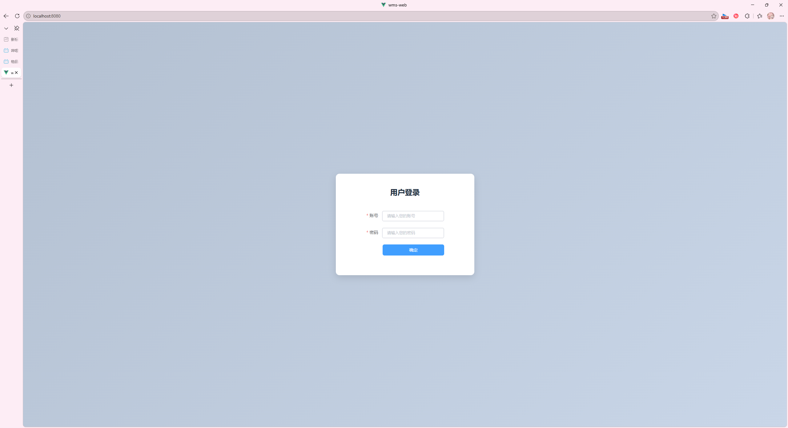
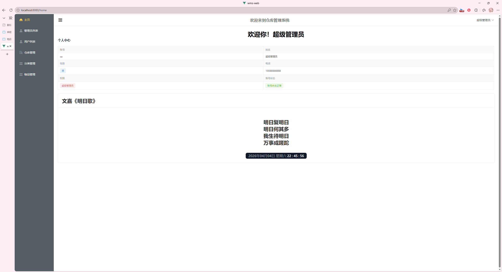
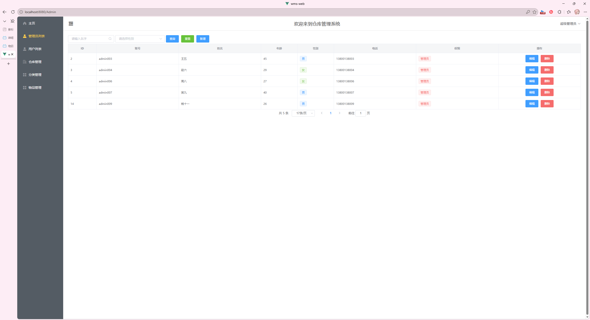
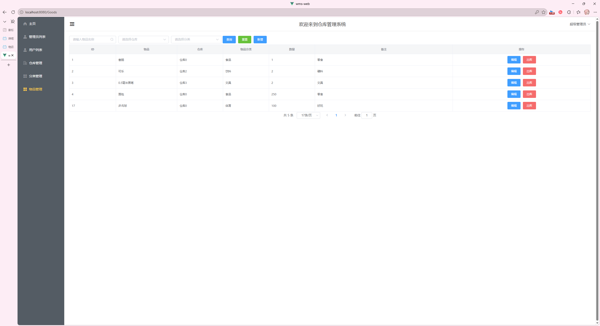
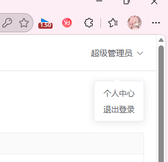
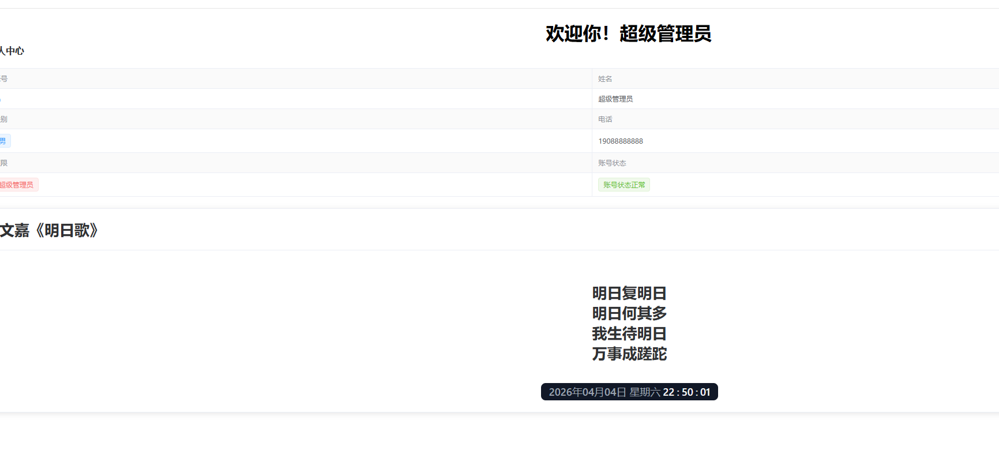
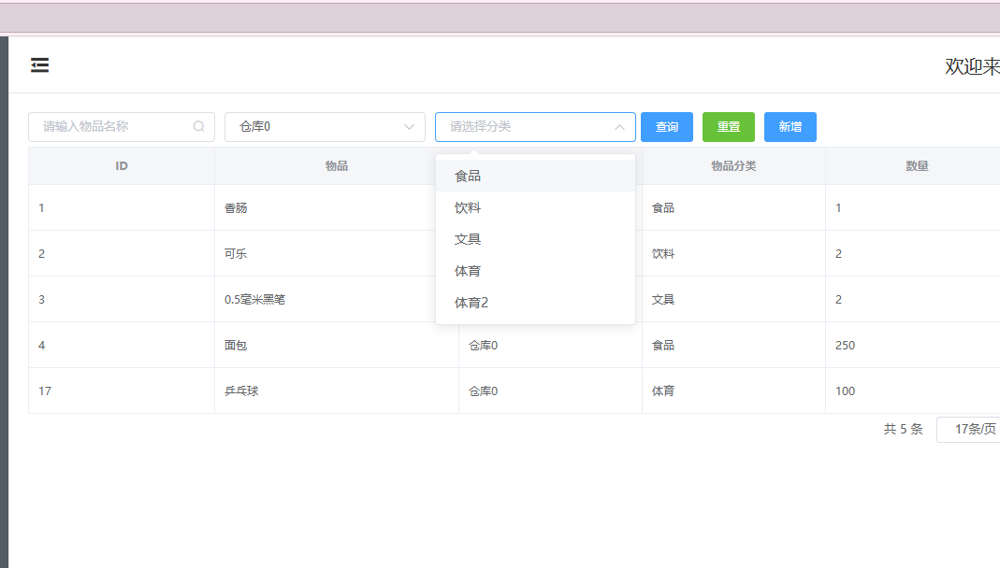
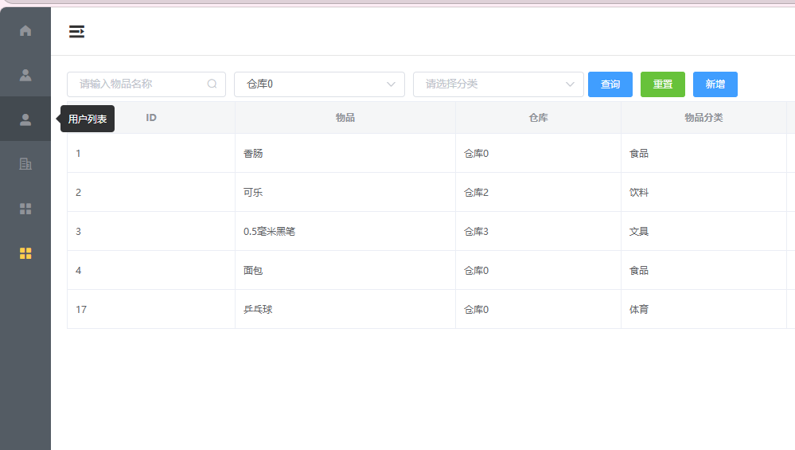
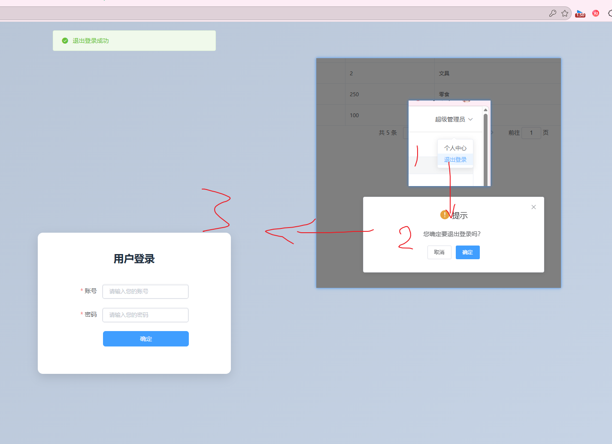
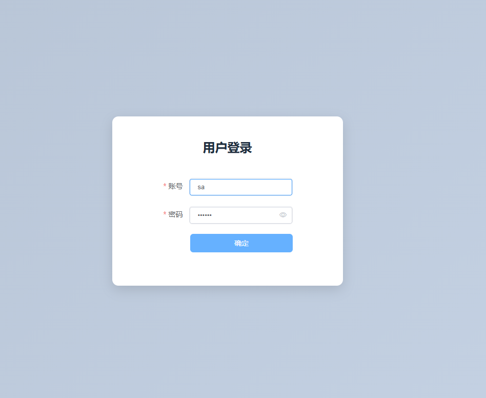

# 技术栈
## 🔹 前端技术
Vue.js 2.6 - 渐进式JavaScript框架 
Vue Router 3.5 - 前端路由管理 
Vuex 3.0 - 状态管理（配合持久化插件） 
Element UI 2.15 - UI组件库 
Axios 1.13 - HTTP请求封装 
🔹 后端技术 
Spring Boot 4.0.2 - 后端框架 
MyBatis-Plus 3.5.15 - ORM持久层框架 
MySQL - 关系型数据库 
JWT (JJWT 0.11.5) - Token认证机制 
Swagger - API接口文档 
Lombok - 简化Java代码 
Maven - 项目构建工具 
🔹 开发环境 
JDK 17 
Node.js (前端运行环境) 
端口配置: 后端8090，前端默认8080 

# 登录页面

***

# 个人首页

***

# 管理员页面

***

# 物品管理页面

# 一些功能的展示

## 1. 首页右上角名片

## 2. 首页诗词-时间模块

## 3. 物品筛选功能

## 4. 侧边栏伸缩功能

## 5.登录功能&退出登录功能

